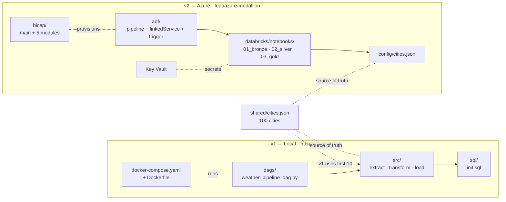

# Architecture

> A single, opinionated map of the repo. For the design rationale and
> the v1 → v2 story, read [`docs/evolution.md`](./docs/evolution.md).
> For a side-by-side feature comparison, see
> [`docs/architecture/comparison.md`](./docs/architecture/comparison.md).

## Repo at a glance



## How the pieces talk

| From | To | Mechanism |
|---|---|---|
| Airflow scheduler (v1) | Postgres | SQLAlchemy (raw + analytics schemas) |
| ADF (v2) | Databricks workspace | Service principal in Key Vault → linked service |
| Databricks (v2) | ADLS Gen2 | Databricks managed identity (Storage Blob Data Contributor) |
| Databricks (v2) | Key Vault | Databricks managed identity (Key Vault Secrets User) |
| v1 extract | Weatherstack | `requests` over HTTPS (sequential) |
| v2 Bronze notebook | Weatherstack | `urllib` + `ThreadPoolExecutor(10)` |

## Read the docs in this order

1. **This file** — 30 seconds. "What is in this repo?"
2. **[`README.md`](./README.md)** — 5 minutes. The two-version pitch + quick starts.
3. **[`docs/evolution.md`](./docs/evolution.md)** — 20 minutes. The *why* behind the migration.
4. **[`docs/architecture/comparison.md`](./docs/architecture/comparison.md)** — 10 minutes. Stage-by-stage diff with diagrams.
5. **[`azure/README.md`](./azure/README.md)** — 30 minutes. v2 architecture, deploy guide, Bicep modules.
6. The code itself — v1 (`src/`, `dags/`) and v2 (`azure/databricks/`, `azure/bicep/`).

## File-by-file map

```
weather_etl_pipeline/
├── README.md                  ← pitch + v1 quick start
├── ARCHITECTURE.md            ← this file
├── Makefile                   ← convenience: make up, make down, make test
├── Dockerfile                 ← custom Airflow 2.10.3 image (v1)
├── docker-compose.yaml        ← 4-service local stack (v1)
├── requirements.txt           ← v1 Python deps
├── dags/                      ← Airflow DAG (v1)
├── src/                       ← ETL logic (v1)
├── sql/                       ← Postgres init (v1)
├── shared/                    ← cities.json — shared between v1 and v2
├── tests/                     ← v1 unit tests (stdlib unittest)
├── docs/
│   ├── evolution.md           ← v1 → v2 migration story
│   ├── architecture/
│   │   └── comparison.md      ← stage-by-stage v1 vs v2
│   ├── ETL_DAG.png            ← v1 DAG visualisation
│   ├── pipeline_architecture.png
│   ├── raw_output.png         ← v1 sample output
│   └── analytics_output.png   ← v1 sample output
└── azure/                     ← v2 (ADF + Databricks + ADLS Gen2)
    ├── README.md              ← v2 architecture + deploy overview
    ├── deploy.md              ← end-to-end deploy guide
    ├── bicep/                 ← 1 main + 5 modules (Bicep)
    ├── adf/                   ← pipeline + linked services + trigger
    ├── databricks/
    │   ├── notebooks/         ← 3 notebooks (Bronze / Silver / Gold)
    │   ├── libs/              ← 3 libs (weather_client, schemas, storage)
    │   └── tests/             ← 14 unit tests (stdlib unittest)
    ├── config/                ← v2 copy of cities.json
    └── tests/                 ← reserved for v2 unit tests
```
