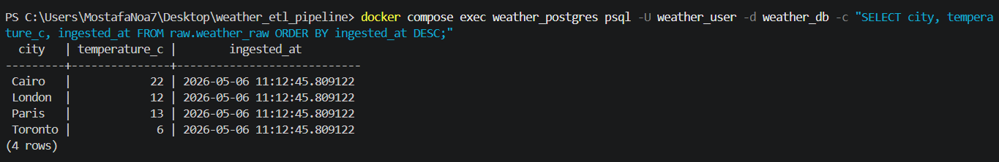
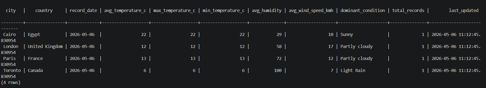

# Weather ETL Pipeline

An end-to-end ETL (Extract, Transform, Load) pipeline that fetches current weather data from the Weatherstack API, processes it using Python, and stores it in PostgreSQL. The workflow is orchestrated by Apache Airflow and runs entirely in Docker containers for easy setup and deployment.

## Architecture

```
Weatherstack API → Extract → Transform → Load → PostgreSQL
     ↓              ↓         ↓         ↓         ↓
  HTTP/JSON     Raw JSON  Clean Data  Insert   Raw & Analytics Tables
```

- **Extract**: Fetches weather data for 10 cities using the Weatherstack API.
- **Transform**: Cleans and parses the raw JSON into a structured format using Pandas.
- **Load**: Inserts data into PostgreSQL tables via SQLAlchemy.
- **Orchestration**: Apache Airflow schedules the pipeline every 6 hours.

All components run in Docker — no local installations needed.

## Tech Stack

- **Python 3.11**: Handles ETL logic.
- **Weatherstack API**: Provides real-time weather data.
- **PostgreSQL 13**: Stores raw and processed data.
- **Apache Airflow 2.10.3**: Manages and schedules the pipeline.
- **Docker & Docker Compose**: Containerizes the entire setup.
- **SQLAlchemy**: Connects to the database.
- **Pandas**: Processes and cleans data.

## Project Structure

```
weather_etl_pipeline/
├── dags/
│   └── weather_pipeline_dag.py    # Airflow DAG defining the ETL tasks
├── src/
│   ├── extract.py                 # Fetches data from Weatherstack API
│   ├── transform.py               # Cleans and transforms the data
│   └── load.py                    # Loads data into PostgreSQL
├── sql/
│   └── init.sql                   # Creates database tables on startup
├── docs/                          # Documents and images
├── logs/                          # Airflow logs (generated automatically)
├── .env                           # Environment variables (configure API keys, etc.)
├── docker-compose.yaml            # Defines Docker services
├── Dockerfile                     # Builds the custom Airflow image
├── requirements.txt               # Python dependencies
└── README.md                      # This file
```

## Prerequisites

- [Docker Desktop](https://www.docker.com/products/docker-desktop) installed and running.
- A free API key from [Weatherstack](https://weatherstack.com) (sign up for a free account).

That's all — no need to install Python, PostgreSQL, or Airflow locally.

## Getting Started

### 1. Clone the Repository

```bash
git clone https://github.com/MostafaNouh0011/weather-etl-pipeline.git
cd weather-etl-pipeline
```

### 2. Set Up Environment Variables

Copy the example environment file and edit it:

```bash
cp .env .env  # (Already exists; edit directly)
```

Open `.env` and add your Weatherstack API key. The other values are pre-configured for Docker:

```env
WEATHERSTACK_API_KEY=your_api_key_here
# Other variables are set for local development
```

### 3. Build and Start the Containers

Build the Docker images and start the services:

```bash
docker compose build
docker compose up -d
```

This starts 4 services: Airflow webserver, scheduler, and two PostgreSQL databases.

### 4. Wait for Initialization

Monitor the setup logs:

```bash
docker compose logs -f airflow-init
```

Wait until you see "Admin user created" and the version output, then press `Ctrl+C`.

### 5. Access the Airflow UI

Open [http://localhost:8080](http://localhost:8080) in your browser.

- **Username**: admin
- **Password**: admin

Find the `weather_etl_pipeline` DAG, toggle it **ON**, and click the play button (▶) to run it manually.

### 6. Check the Data

Connect to the weather database (exposed on port 5433):

```bash
docker compose exec weather_postgres psql -U weather_user -d weather_db
```

Run these queries:

```sql
-- View recent raw data
SELECT city, temperature_c, ingested_at
FROM raw.weather_raw
ORDER BY ingested_at DESC
LIMIT 5;
```


```sql
-- View summary data
SELECT city, country, record_date, avg_temperature_c, max_temperature_c, min_temperature_c, avg_humidity, avg_wind_speed_kmh, dominant_condition, total_records, last_updated
FROM analytics.weather_summary
ORDER BY record_date DESC;
```


## DAG Details

The pipeline runs three tasks in sequence:

- **Extract**: Calls the API for 10 cities and stores raw responses.
- **Transform**: Parses and cleans the data into a usable format.
- **Load**: Saves data to PostgreSQL and updates summaries.

**Schedule**: Every 6 hours.  
**Retries**: 2 times with 5-minute delays.  
**Catchup**: Disabled (only runs future schedules).

## Database Schema

The pipeline uses two schemas:

### Raw Layer (`raw.weather_raw`)
Stores every API response as-is.

| Column | Type | Description |
|--------|------|-------------|
| id | SERIAL | Primary key |
| city | VARCHAR | City name |
| country | VARCHAR | Country |
| temperature_c | FLOAT | Temperature in Celsius |
| humidity | INT | Humidity percentage |
| wind_speed_kmh | FLOAT | Wind speed |
| ... | ... | Other weather fields |
| ingested_at | TIMESTAMP | When data was loaded |

### Analytics Layer (`analytics.weather_summary`)
Aggregates daily weather stats per city.

| Column | Type | Description |
|--------|------|-------------|
| city | VARCHAR | City name |
| record_date | DATE | Date of records |
| avg_temperature_c | FLOAT | Daily average temperature |
| max_temperature_c | FLOAT | Daily max temperature |
| min_temperature_c | FLOAT | Daily min temperature |
| avg_humidity | FLOAT | Daily average humidity |
| total_records | INT | Number of records |
| last_updated | TIMESTAMP | Last update time |

## Troubleshooting

- **Containers won't start**: Ensure Docker is running and ports 8080/5433 are free.
- **API errors**: Check your Weatherstack API key in `.env`.
- **DAG fails**: View logs in the Airflow UI or check `logs/` folder.
- **Database connection issues**: Verify PostgreSQL is healthy with `docker compose ps`.

For more help, check the Airflow documentation or open an issue on GitHub.

## Database Schema

### `raw.weather_raw` — Bronze Layer
Stores every API response exactly as received, one row per city per pipeline run.

| Column | Type | Description |
|---|---|---|
| `id` | SERIAL PK | Auto-increment primary key |
| `city` | VARCHAR | City name |
| `country` | VARCHAR | Country name |
| `temperature_c` | FLOAT | Temperature in Celsius |
| `feels_like_c` | FLOAT | Feels-like temperature |
| `humidity` | INT | Humidity percentage |
| `wind_speed_kmh` | FLOAT | Wind speed in km/h |
| `wind_direction` | VARCHAR | Wind direction (N, NE, SW, etc.) |
| `weather_description` | VARCHAR | Human-readable condition |
| `uv_index` | INT | UV index |
| `pressure` | INT | Atmospheric pressure |
| `is_day` | BOOLEAN | Whether it's daytime |
| `ingested_at` | TIMESTAMP | When the row was inserted |

### `analytics.weather_summary` — Gold Layer
Daily aggregated weather per city. Refreshed on every pipeline run using upsert.

| Column | Type | Description |
|---|---|---|
| `city` | VARCHAR | City name |
| `record_date` | DATE | Date of aggregation |
| `avg_temperature_c` | FLOAT | Daily average temperature |
| `max_temperature_c` | FLOAT | Daily high |
| `min_temperature_c` | FLOAT | Daily low |
| `avg_humidity` | FLOAT | Daily average humidity |
| `avg_wind_speed_kmh` | FLOAT | Daily average wind speed |
| `dominant_condition` | VARCHAR | Most frequent weather condition |
| `total_records` | INT | Number of raw records aggregated |

---

## Makefile Commands

```bash
make build    # Build Docker images
make up       # Start all containers in background
make down     # Stop all containers (data preserved)
make reset    # Stop all containers and delete all data
make logs     # Stream scheduler logs
make psql     # Open PostgreSQL shell in weather DB
```

---

## Cities Tracked

Cairo · Alexandria · Dubai · London · New York · Paris · Tokyo · Sydney · Berlin · Toronto

To add or change cities, edit the `CITIES` list in `src/extract.py`.

---

## Environment Variables Reference

| Variable | Description |
|---|---|
| `WEATHERSTACK_API_KEY` | Your Weatherstack API key |
| `WEATHER_DB_HOST` | PostgreSQL host (use `weather_postgres` inside Docker) |
| `WEATHER_DB_PORT` | PostgreSQL port (default: `5432`) |
| `WEATHER_DB_NAME` | Database name |
| `WEATHER_DB_USER` | Database user |
| `WEATHER_DB_PASSWORD` | Database password |
| `AIRFLOW__CORE__FERNET_KEY` | Encryption key for Airflow secrets |
| `AIRFLOW_ADMIN_USERNAME` | Airflow UI username |
| `AIRFLOW_ADMIN_PASSWORD` | Airflow UI password |

---

## License

MIT License — free to use, modify, and share.
